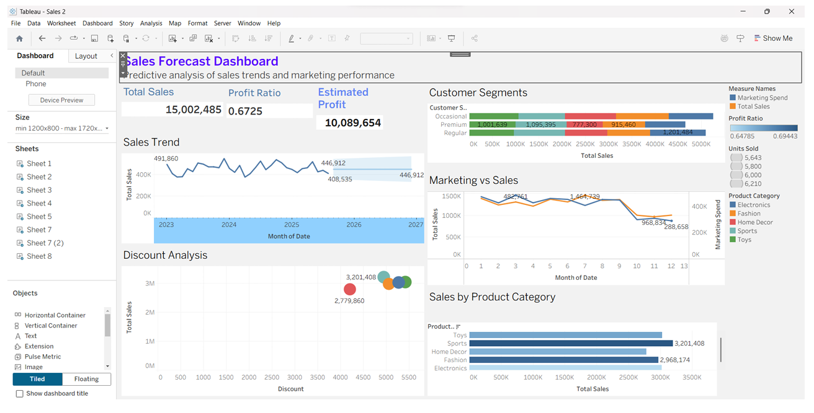

# Sales Forecast Analysis Using Tableau

This project is a data visualization mini project focused on sales forecasting and business performance analysis using Tableau.

The dashboard analyzes sales trends, product categories, customer segments, marketing spend, discount impact, estimated profit, and profitability indicators to support data-driven business decisions.

## Project Overview

Organizations use sales analytics to understand revenue performance, customer behavior, product demand, and future business trends. This project builds an interactive Tableau dashboard and story to convert raw sales data into useful business insights.

## Objectives

- Analyze historical sales data and sales performance.
- Visualize key business metrics using Tableau dashboards.
- Study the relationship between marketing spend and sales.
- Understand sales by product category and customer segment.
- Analyze discount impact and profitability.
- Forecast future sales trends for better decision-making.

## Tools Used

| Area | Tools |
| --- | --- |
| Visualization | Tableau |
| Data Analysis | Calculated fields, filters, charts, dashboards |
| Datasets | Ecommerce sales data, Superstore sales data |

## Dataset Fields

The ecommerce sales dataset includes:

- `Date`
- `Product_Category`
- `Price`
- `Discount`
- `Customer_Segment`
- `Marketing_Spend`
- `Units_Sold`

The superstore dataset includes order, customer, region, category, sub-category, product, shipping, and sales fields.

Sample data files are available in the [`data`](data) folder.

## Dashboard Screenshot



## Tableau Workbooks

The Tableau workbook files are available in:

```text
tableau-workbooks/
```

Included workbooks:
- `sales-2.twb`

## Project Report

The full mini project report is available in:

```text
docs/sales-forecast-analysis-report.pdf
```

## Key Insights

- Sales trends help identify business growth patterns over time.
- Marketing spend can be compared with sales to understand campaign effectiveness.
- Product category analysis helps identify strong and weak product segments.
- Discount analysis supports pricing and promotion decisions.
- Customer segment analysis helps understand buyer behavior.
- Forecasting supports future planning and inventory decisions.

## What I Learned

- Creating Tableau worksheets, dashboards, and stories
- Building calculated fields for sales and profitability analysis
- Using charts to communicate business insights
- Designing dashboard layouts for decision-making
- Converting raw sales data into visual business intelligence

## Author

Yashaswini  
GitHub: [@yashas-334](https://github.com/yashas-334)
